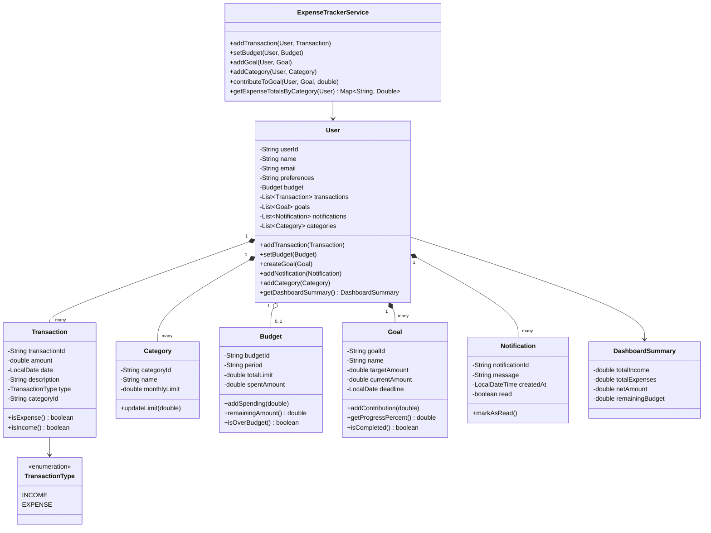

# Personal Expenses Calculator UML

```mermaid
classDiagram
    class User {
        -String userId
        -String name
        -String email
        -String preferences
        -Budget budget
        -List~Transaction~ transactions
        -List~Goal~ goals
        -List~Notification~ notifications
        -List~Category~ categories
        +addTransaction(Transaction)
        +setBudget(Budget)
        +createGoal(Goal)
        +addNotification(Notification)
        +addCategory(Category)
        +getDashboardSummary() DashboardSummary
    }

    class Transaction {
        -String transactionId
        -double amount
        -LocalDate date
        -String description
        -TransactionType type
        -String categoryId
        +isExpense() boolean
        +isIncome() boolean
    }

    class Category {
        -String categoryId
        -String name
        -double monthlyLimit
        +updateLimit(double)
    }

    class Budget {
        -String budgetId
        -String period
        -double totalLimit
        -double spentAmount
        +addSpending(double)
        +remainingAmount() double
        +isOverBudget() boolean
    }

    class Goal {
        -String goalId
        -String name
        -double targetAmount
        -double currentAmount
        -LocalDate deadline
        +addContribution(double)
        +getProgressPercent() double
        +isCompleted() boolean
    }

    class Notification {
        -String notificationId
        -String message
        -LocalDateTime createdAt
        -boolean read
        +markAsRead()
    }

    class DashboardSummary {
        -double totalIncome
        -double totalExpenses
        -double netAmount
        -double remainingBudget
    }

    class ExpenseTrackerService {
        +addTransaction(User, Transaction)
        +setBudget(User, Budget)
        +addGoal(User, Goal)
        +addCategory(User, Category)
        +contributeToGoal(User, Goal, double)
        +getExpenseTotalsByCategory(User) Map~String, Double~
    }

    class TransactionType {
        <<enumeration>>
        INCOME
        EXPENSE
    }

    User "1" *-- "many" Transaction
    User "1" *-- "many" Category
    User "1" *-- "many" Goal
    User "1" *-- "many" Notification
    User "1" o-- "0..1" Budget
    Transaction --> TransactionType
    User --> DashboardSummary
    ExpenseTrackerService --> User
```
